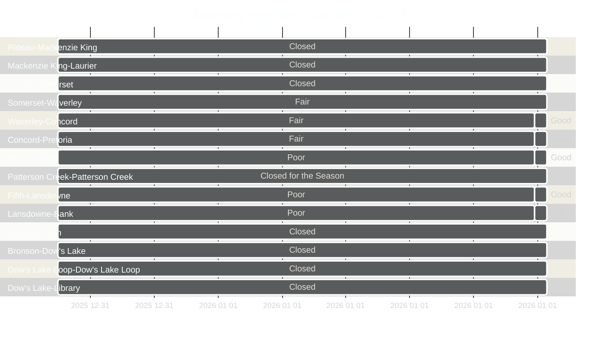

For the last two Rideau Canal skating seasons I've had a little data collection project running to automatically collect the ice conditions from NCC's open data, and then store it as timeseries in a CSV.

Along the way I've used this little project as example data to learn & practice, share, and talk about data science and analytics. 

The original post talks about quickly converting geospatial data from ESRI into CSV for analysts not from a geo data background - [LinkedIn Article](https://www.linkedin.com/pulse/opendatadays-geospatial-data-non-geo-users-patrick-little-mba-udclc) and there is also a example notebook [here](https://gist.github.com/PatLittle/413eef25fae1d1a2e1d5be7ee38c79d0)

As of 2025-12-27 I reenabled the automated data collection, and the third year of data is now being added to the longitudinal dataset. 

<a target="_blank" href="https://flatgithub.com/PatLittle/skateway_data?filename=current_conditions.csv&sort=Current_Datetime%2Cdesc&stickyColumnName=Current_Datetime" style="text-align:right;">
  open in new tab↗
</a>

<iframe
  src="https://flatgithub.com/PatLittle/skateway_data?filename=current_conditions.csv&sort=Current_Datetime%2Cdesc&stickyColumnName=Current_Datetime"
  title="conditions"
  width="800"
  height="800"> 
</iframe>

## Visual Export

I also was interested to in exporting a PNG of the GeoJSON and keeping the image file in source control, then using that githistory for creating an animation, or just having the GH visual diff to view the changes. 

This image will recieve changes daily and the GH has 3 different ways to visually compare the changes. More info here [Github - rendering and diffing images](https://docs.github.com/en/repositories/working-with-files/using-files/working-with-non-code-files#viewing-differences) 

## Mermaid Gantt Chart as a timeseries visualization

This was also a experiment with using mermaid gantt chart as a way to visualize the conditions overtime, while keeping the spatial context of how the geography appears on a map. 

As you can see the Gantt chart is a decently coherent abstraction of the map above. 

With the sections listed from North to South, this type visual is an interesting mid-point between the typical presentation of quantitative data and spatial information, but with the added timeseries dimension. 

I may experiment with scaling the bar heights to match the length of each segment to make it convey proportions of the ice conditions better, or other scalings may be interesting such as scaling to usage traffic. 

More info on the Gantt Chart Syntax here - https://docs.mermaidchart.com/mermaid-oss/syntax/gantt.html#output-in-compact-mode
