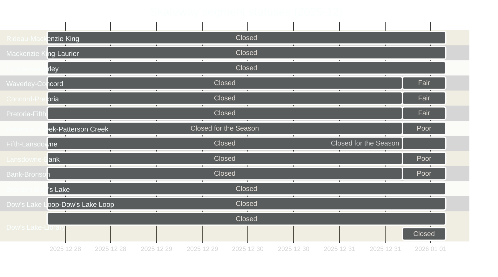

For the last two Rideau Canal skating seasons I've had a little data collection project running to automatically collect the ice conditions from the NCC's open data, and then store it as timeseries in a CSV.
Along the way I've used this little project as example data to learn & practice, share, and talk about data science and analytics.

As of 2025-12-27 I reenabled the automated data collection, and the third year of data is now being added to the longitudinal dataset. 

<iframe
  src="https://flatgithub.com/PatLittle/skateway_data?filename=current_conditions.csv&sort=Current_Datetime%2Cdesc&stickyColumnName=Current_Datetime"
  title="conditions"
  width="400"
  height="300">
</iframe>

1. **Limit work in progress.** Choose fewer big bets so the team can win.
2. **Share the why.** Every roadmap item should explain the customer impact.
3. **Review monthly.** Make small course corrections before they become pivots.
