Over the last two seasons of skating on the Rideau Canal I've had a little data collection project running, automatically collecting the ice conditions from NCC's ESRI map server on their open data portal and then storing it as timeseries in a CSV. The original inspiration was to demonstrate how to convert data from a more niche source like GeoSpatial Services into plain CSV, enabling Data Analysts without a GeoData background to leverage these abundant, and high quality data sources.  

> This is the original post I made in 2024, talking about quickly converting geospatial data from ESRI into CSV for analysts not from a geo data background - [LinkedIn Article](https://www.linkedin.com/pulse/opendatadays-geospatial-data-non-geo-users-patrick-little-mba-udclc) 
> and there is also a example notebook [here](https://gist.github.com/PatLittle/413eef25fae1d1a2e1d5be7ee38c79d0)

Along the way I've used this little project as a sandbox to learn & practice different techniques/tools/technologies, as well as to share some tips and talk about data science and analytics. 

⛸️ Since the ice is open for 2026 I unpaused the automated data collection, and the third year of data is now being added to the longitudinal dataset. 

<iframe
  src="https://flatgithub.com/PatLittle/skateway_data?filename=current_conditions.csv&sort=Current_Datetime%2Cdesc&stickyColumnName=Current_Datetime"
  title="conditions"
  width="800"
  height="800"> 
</iframe>
<a target="_blank" href="https://flatgithub.com/PatLittle/skateway_data?filename=current_conditions.csv&sort=Current_Datetime%2Cdesc&stickyColumnName=Current_Datetime" style="text-align:right;">
  open data in new tab↗
</a>

## Visual Export

I also was interested to in image exports of the GeoJSON with the image file in source control. Using the `git history` to get all the changes I was think it could be used for creating an animation, or just having the GitHub visual diff to view the changes. 

This image will receive changes daily and the GH has 3 different ways to visually compare the changes. More info here [Github - rendering and diffing images](https://docs.github.com/en/repositories/working-with-files/using-files/working-with-non-code-files#viewing-differences) 

## Mermaid Gantt Chart as a timeseries visualization

I'm also experimenting with using a mermaidjs gantt chart as a way to visualize the conditions overtime, while keeping the spatial context of how the geography appears on a map. 

As you can see the Gantt chart is a decently coherent abstraction of the map above. 

```mermaid
---
topAxis: true
displayMode: compact
config:
  themeCSS: " #vg { fill: Green } #g {fill: GreenYellow} #f {fill: orange} #p {fill: red}      

#c {fill: Black} #cs {fill: Black} #sc {fill: White} #wo {fill: saddlebrown} 

             text[id^=c] { fill: white; } text[id^=cs] { fill: red; } text[id^=sc] { fill: red; }
            .taskTextOutsideRight[id^=sc] { fill:black; text-anchor: end; }
        "

---

gantt
  title Skateway segment statuses (2026-01)
  dateFormat  YYYY-MM-DD HH:mm:ss
  axisFormat  %Y %m %d
  section Rideau-Mackenzie King
  Closed: c, 2025-12-31 21:07:33, 2026-01-03 16:27:35
  Good: g, 2026-01-03 16:27:35, 2026-01-05 16:29:55
  Very Good: vg, 2026-01-05 16:29:55, 2026-01-06 01:51:43
  Snow Covered: sc, 2026-01-06 01:51:43, 2026-01-06 16:31:50
  Very Good: vg, 2026-01-06 16:31:50, 2026-01-07 16:33:13
  Snow Covered: sc, 2026-01-07 16:33:13, 2026-01-08 01:51:39
  Good: g, 2026-01-08 01:51:39, 2026-01-09 01:52:12
  Fair: f, 2026-01-09 01:52:12, 2026-01-09 08:33:47
  Closed: c, 2026-01-09 08:33:47, 2026-01-11 02:00:53
  section Mackenzie King-Laurier
  Closed: c, 2025-12-31 21:07:33, 2026-01-03 16:27:35
  Good: g, 2026-01-03 16:27:35, 2026-01-04 16:26:52
  Very Good: vg, 2026-01-04 16:26:52, 2026-01-06 01:51:43
  Snow Covered: sc, 2026-01-06 01:51:43, 2026-01-06 16:31:50
  Very Good: vg, 2026-01-06 16:31:50, 2026-01-07 16:33:13
  Snow Covered: sc, 2026-01-07 16:33:13, 2026-01-08 01:51:39
  Good: g, 2026-01-08 01:51:39, 2026-01-09 01:52:12
  Fair: f, 2026-01-09 01:52:12, 2026-01-09 08:33:47
  Closed: c, 2026-01-09 08:33:47, 2026-01-11 02:00:53
  section Laurier-Somerset
  Closed: c, 2025-12-31 21:07:33, 2026-01-03 16:27:35
  Good: g, 2026-01-03 16:27:35, 2026-01-04 16:26:52
  Very Good: vg, 2026-01-04 16:26:52, 2026-01-06 01:51:43
  Snow Covered: sc, 2026-01-06 01:51:43, 2026-01-06 16:31:50
  Very Good: vg, 2026-01-06 16:31:50, 2026-01-07 16:33:13
  Snow Covered: sc, 2026-01-07 16:33:13, 2026-01-08 01:51:39
  Good: g, 2026-01-08 01:51:39, 2026-01-09 01:52:12
  Fair: f, 2026-01-09 01:52:12, 2026-01-09 08:33:47
  Closed: c, 2026-01-09 08:33:47, 2026-01-11 02:00:53
  section Somerset-Waverley
  Fair: f, 2025-12-31 21:07:33, 2026-01-02 16:28:08
  Good: g, 2026-01-02 16:28:08, 2026-01-04 16:26:52
  Very Good: vg, 2026-01-04 16:26:52, 2026-01-06 01:51:43
  Snow Covered: sc, 2026-01-06 01:51:43, 2026-01-06 16:31:50
  Very Good: vg, 2026-01-06 16:31:50, 2026-01-07 16:33:13
  Snow Covered: sc, 2026-01-07 16:33:13, 2026-01-08 01:51:39
  Good: g, 2026-01-08 01:51:39, 2026-01-09 01:52:12
  Fair: f, 2026-01-09 01:52:12, 2026-01-09 08:33:47
  Closed: c, 2026-01-09 08:33:47, 2026-01-11 02:00:53
  section Waverley-Concord
  Fair: f, 2025-12-31 21:07:33, 2026-01-01 14:52:27
  Good: g, 2026-01-01 14:52:27, 2026-01-04 16:26:52
  Very Good: vg, 2026-01-04 16:26:52, 2026-01-06 01:51:43
  Snow Covered: sc, 2026-01-06 01:51:43, 2026-01-06 16:31:50
  Very Good: vg, 2026-01-06 16:31:50, 2026-01-07 16:33:13
  Snow Covered: sc, 2026-01-07 16:33:13, 2026-01-08 01:51:39
  Good: g, 2026-01-08 01:51:39, 2026-01-09 01:52:12
  Fair: f, 2026-01-09 01:52:12, 2026-01-09 08:33:47
  Closed: c, 2026-01-09 08:33:47, 2026-01-11 02:00:53
  section Concord-Pretoria
  Fair: f, 2025-12-31 21:07:33, 2026-01-01 14:52:27
  Good: g, 2026-01-01 14:52:27, 2026-01-04 16:26:52
  Very Good: vg, 2026-01-04 16:26:52, 2026-01-06 01:51:43
  Snow Covered: sc, 2026-01-06 01:51:43, 2026-01-06 16:31:50
  Very Good: vg, 2026-01-06 16:31:50, 2026-01-07 16:33:13
  Snow Covered: sc, 2026-01-07 16:33:13, 2026-01-08 01:51:39
  Good: g, 2026-01-08 01:51:39, 2026-01-09 01:52:12
  Fair: f, 2026-01-09 01:52:12, 2026-01-09 08:33:47
  Closed: c, 2026-01-09 08:33:47, 2026-01-11 02:00:53
  section Pretoria-Fifth
  Poor: p, 2025-12-31 21:07:33, 2026-01-01 14:52:27
  Good: g, 2026-01-01 14:52:27, 2026-01-04 16:26:52
  Very Good: vg, 2026-01-04 16:26:52, 2026-01-06 01:51:43
  Snow Covered: sc, 2026-01-06 01:51:43, 2026-01-06 16:31:50
  Very Good: vg, 2026-01-06 16:31:50, 2026-01-07 16:33:13
  Snow Covered: sc, 2026-01-07 16:33:13, 2026-01-08 01:51:39
  Good: g, 2026-01-08 01:51:39, 2026-01-09 01:52:12
  Fair: f, 2026-01-09 01:52:12, 2026-01-09 08:33:47
  Closed: c, 2026-01-09 08:33:47, 2026-01-11 02:00:53
  section Patterson Creek-Patterson Creek
  Closed for the Season: cs, 2025-12-31 21:07:33, 2026-01-09 08:33:47
  Closed: c, 2026-01-09 08:33:47, 2026-01-09 16:30:59
  Closed for the Season: cs, 2026-01-09 16:30:59, 2026-01-11 02:00:53
  section Fifth-Lansdowne
  Poor: p, 2025-12-31 21:07:33, 2026-01-01 14:52:27
  Good: g, 2026-01-01 14:52:27, 2026-01-04 16:26:52
  Very Good: vg, 2026-01-04 16:26:52, 2026-01-06 01:51:43
  Snow Covered: sc, 2026-01-06 01:51:43, 2026-01-06 16:31:50
  Very Good: vg, 2026-01-06 16:31:50, 2026-01-07 16:33:13
  Snow Covered: sc, 2026-01-07 16:33:13, 2026-01-08 01:51:39
  Good: g, 2026-01-08 01:51:39, 2026-01-09 01:52:12
  Fair: f, 2026-01-09 01:52:12, 2026-01-09 08:33:47
  Closed: c, 2026-01-09 08:33:47, 2026-01-11 02:00:53
  section Lansdowne-Bank
  Poor: p, 2025-12-31 21:07:33, 2026-01-01 14:52:27
  Fair: f, 2026-01-01 14:52:27, 2026-01-02 16:28:08
  Good: g, 2026-01-02 16:28:08, 2026-01-04 16:26:52
  Very Good: vg, 2026-01-04 16:26:52, 2026-01-06 01:51:43
  Snow Covered: sc, 2026-01-06 01:51:43, 2026-01-06 16:31:50
  Very Good: vg, 2026-01-06 16:31:50, 2026-01-07 16:33:13
  Snow Covered: sc, 2026-01-07 16:33:13, 2026-01-08 01:51:39
  Good: g, 2026-01-08 01:51:39, 2026-01-09 01:52:12
  Fair: f, 2026-01-09 01:52:12, 2026-01-09 08:33:47
  Closed: c, 2026-01-09 08:33:47, 2026-01-11 02:00:53
  section Bank-Bronson
  Closed: c, 2025-12-31 21:07:33, 2026-01-05 16:29:55
  Poor: p, 2026-01-05 16:29:55, 2026-01-06 01:51:43
  Snow Covered: sc, 2026-01-06 01:51:43, 2026-01-06 16:31:50
  Fair: f, 2026-01-06 16:31:50, 2026-01-07 16:33:13
  Snow Covered: sc, 2026-01-07 16:33:13, 2026-01-08 01:51:39
  Fair: f, 2026-01-08 01:51:39, 2026-01-09 08:33:47
  Closed: c, 2026-01-09 08:33:47, 2026-01-11 02:00:53
  section Bronson-Dow's Lake
  Closed: c, 2025-12-31 21:07:33, 2026-01-05 16:29:55
  Fair: f, 2026-01-05 16:29:55, 2026-01-06 01:51:43
  Snow Covered: sc, 2026-01-06 01:51:43, 2026-01-06 16:31:50
  Good: g, 2026-01-06 16:31:50, 2026-01-07 16:33:13
  Snow Covered: sc, 2026-01-07 16:33:13, 2026-01-08 01:51:39
  Fair: f, 2026-01-08 01:51:39, 2026-01-09 08:33:47
  Closed: c, 2026-01-09 08:33:47, 2026-01-11 02:00:53
  section Dow's Lake Loop-Dow's Lake Loop
  Closed: c, 2025-12-31 21:07:33, 2026-01-05 16:29:55
  Fair: f, 2026-01-05 16:29:55, 2026-01-06 01:51:43
  Snow Covered: sc, 2026-01-06 01:51:43, 2026-01-06 16:31:50
  Good: g, 2026-01-06 16:31:50, 2026-01-07 16:33:13
  Snow Covered: sc, 2026-01-07 16:33:13, 2026-01-08 01:51:39
  Fair: f, 2026-01-08 01:51:39, 2026-01-09 08:33:47
  Closed: c, 2026-01-09 08:33:47, 2026-01-11 02:00:53
  section Dow's Lake-Library
  Closed: c, 2025-12-31 21:07:33, 2026-01-05 16:29:55
  Fair: f, 2026-01-05 16:29:55, 2026-01-06 01:51:43
  Snow Covered: sc, 2026-01-06 01:51:43, 2026-01-06 16:31:50
  Good: g, 2026-01-06 16:31:50, 2026-01-07 16:33:13
  Snow Covered: sc, 2026-01-07 16:33:13, 2026-01-08 01:51:39
  Fair: f, 2026-01-08 01:51:39, 2026-01-09 08:33:47
  Closed: c, 2026-01-09 08:33:47, 2026-01-11 02:00:53
```

With the sections listed from North to South, this type visual is an interesting mid-point between the typical presentation of quantitative data and spatial information, but with the added timeseries dimension.

More info on the Gantt Chart Syntax here - https://docs.mermaidchart.com/mermaid-oss/syntax/gantt.html#output-in-compact-mode

I may experiment with scaling the bar heights to match the length of each segment to make it convey proportions of the ice conditions better, or other scalings may be interesting such as scaling to usage traffic. Or potentially creating a timeseries GeoJSON compilation. 

🤞Hoping for another great season in 2026!
