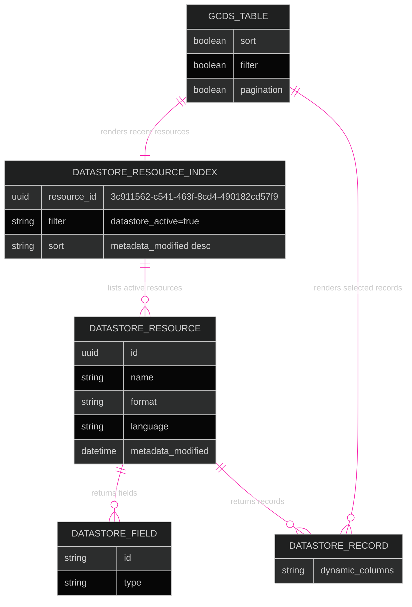
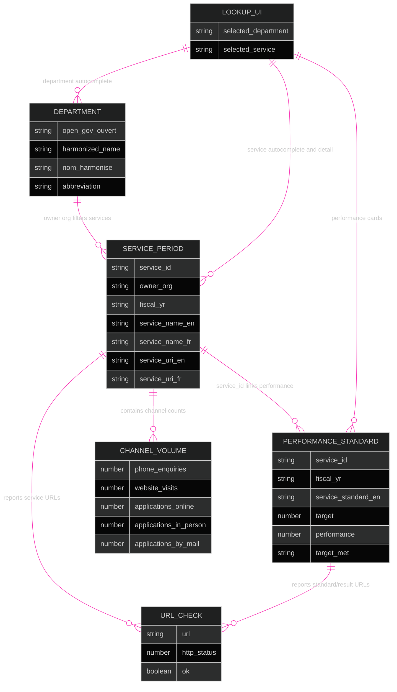
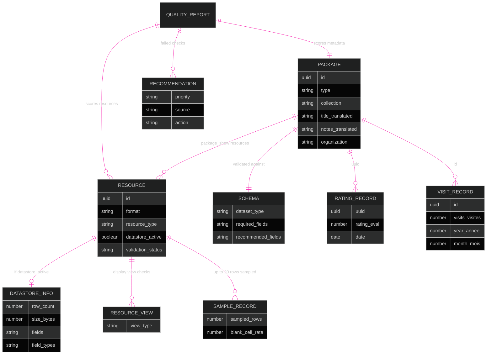

## Using Open Government Portal APIs
The Open Government Portal provides two main APIs that departments can use to bring content from `open.canada.ca` onto other web platforms.

**Metadata API**

The Metadata API contains information about datasets such as the title, description, and date last updated.

**DataStore API**

The DataStore API provides access to the actual tabular data for datasets that were uploaded directly to the system and passed validation checks for structural consistency.

### Atom Feeds

Each organization also automatically has an Atom feed of recent updates or new publications.

`https://open.canada.ca/data/feeds/organization/{organization_name}.atom`

Example:

`https://open.canada.ca/data/feeds/organization/tbs-sct.atom`

### CKAN API docs
These APIs are part of CKAN, the open source data platform used by the Open Government Portal.

The CKAN Action API exposes methods such as `package_show`, `resource_show`, and `datastore_search` for retrieving metadata and table records in JSON.

In practice, this means a web page can call the metadata endpoint to identify a resource, then call the DataStore endpoint to render the live records directly.

[CKAN API documentation↗️](https://docs.ckan.org/en/latest/api/)

## What's New?
These demos below retrieve data directly from open.canada.ca using browser-based API calls.

However until recently, Open.Canada.ca like most Government of Canada APIs did not allow cross-origin requests, even from `.gc.ca` or `canada.ca` websites. This is due to browser security controls known as Cross-Origin Resource Sharing (CORS).

When a web page hosted on <kbd>domain X</kbd> makes a request to get data from <kbd>domain Y</kbd>, a users browser will block the request, unless the server at <kbd>domain Y</kbd> adds an extra piece of infomation (header) agreeing to share it's resources with other websites, either on specific domains, or all domains.

### How It Can Be Worked Around

This doesn't get enforced the same way outside browsers, like from a program installed by a user, or by applications or simple scripts running on a server.

>This is inconvenient for Web Content Developers working in the GC Context.
 

## Demos

The following prototypes show how live Open Government Portal records can be turned into small, task-based data products. They are intentionally browser-only examples so that GC web publishers, developers, and content authors can see what is possible with the existing CKAN APIs, the DataStore, and reusable front-end components.

### [GCDS Table Component for Displaying Tables](https://patlittle.github.io/assets/CkanBackGcdsTableFront.html)

This demo is a minimal pattern for publishing a live DataStore table on a web page with the [GC Design System](https://design-system.canada.ca/en/) table component.

**For publishers:** this pattern is useful when a page needs to show a current slice of an open dataset without manually copying CSV rows into HTML. 

**For developers:** it demonstrates a small integration contract: identify a DataStore resource, call `datastore_search`, normalize the returned fields and records, and bind them to a reusable table component.

The page starts with an index of the 20 most recently modified Open Government Portal resources where `datastore_active` is `true`. 

Each row includes the resource name, format, language, last modified date, resource ID, and a **View records** action. When a user selects a resource, the same table is repopulated with the actual records and fields returned by the DataStore API.

#### Features demonstrated:

* **Live DataStore retrieval:** the page calls `datastore_search` to list active tabular resources and then calls the same endpoint again with a selected `resource_id` to retrieve records.

* **GCDS table behaviours:** the table is configured with sorting, filtering, and pagination, which are common needs for content pages that expose structured data.
* **Transparent API use:** the active API request is shown as a link on the page so developers and content authors can inspect exactly what endpoint and query parameters are powering the view.
* **Progressive context:** the interface begins with a resource list, then adds a back button, resource ID, record count, and horizontal-scroll hint only when a specific resource is opened.

API calls and data fetched:

* `datastore_search` against the Open Canada API base `https://open.canada.ca/data/en/api/3/action/datastore_search`.
* The first request queries resource `3c911562-c541-463f-8cd4-490182cd57f9`, which acts as an index of portal resources. The query filters to `{ datastore_active: "true" }`, sorts by `metadata_modified desc`, and limits the result to 20 records.
* The index response provides the fields displayed in the first table: `name`, `format`, `language`, `metadata_modified`, and `id`.
* When a user selects **View records**, the app makes a second `datastore_search` call using the selected resource's `id` as the `resource_id`.
* The second response provides `result.fields` for dynamic table columns and `result.records` for the rows shown in the GCDS table.

### [Service Inventory Lookup](https://patlittle.github.io/assets/service-inventory-lookup.html)

This demo turns several service-related open datasets into a lookup tool for people who need to find and understand Government of Canada service inventory records.

**For GC web publishers and content authors:** this is an example of using open data as editorial infrastructure: instead of asking users to search a large CSV, the page supports a specific task.

**For developers:** it shows how to join related DataStore resources client-side, keep an accessible live-status experience, and gracefully handle partial data.

The workflow starts with a department search. After a department is selected, the service search is enabled and filtered to services owned by that organization. Selecting a service displays the service inventory ID, bilingual service names, program, description, classification, scope, total applications, and service webpage. The tool also groups all available fiscal-year records for the same service so users can see changes over time.

#### Features demonstrated:

* **Two-step autocomplete:** department and service fields provide type-ahead suggestions, keyboard navigation, and scoped results so authors do not need to know a service ID in advance.
* **Multiple DataStore resources in one product:** the page combines department records, service inventory records, and service performance records from separate Open Government Portal resources.
* **Bilingual interface and data display:** labels, help text, values, and language switching are handled in the front end, while English and French service names, descriptions, and URLs are displayed from the source data.
* **Copyable persistent identifier:** the Service Inventory ID is emphasized and can be copied, supporting cross-linking, analytics work, and consistent references in content or reporting.
* **Fiscal-year comparisons:** service classification, identifier usage, online-service lifecycle steps, AI-enabled status, channel volumes, and performance standards are rendered for each reporting period available.
* **Visual summaries for non-technical audiences:** the demo uses cards, segmented bars, badges, and progress bars to make service standards, channel mix, and online capability fields easier to interpret than a raw table.
* **Reported URL health checks:** service, standard, and performance-result URLs are checked in the browser where possible, with clear handling for missing, invalid, failed, or CORS-blocked links.

API calls and data fetched:

* `datastore_search` at `https://open.canada.ca/data/en/api/3/action/datastore_search` for the service inventory resource `c0cf9766-b85b-48c3-b295-34f72305aaf6`. This loads up to 32,000 service records used for service names, descriptions, service IDs, owner organizations, fiscal years, classifications, online-service fields, channel volumes, AI fields, and service URLs.
* `datastore_search` for the department reference resource `3faaafb4-00e2-4303-947d-ac786b62559f`. This loads department names, acronyms, and Open Government organization identifiers used to populate and filter the department autocomplete.
* After a service is selected, `datastore_search` for the performance resource `8736cd7e-9bf9-4a45-9eee-a6cb3c43c07e`, filtered by `{ service_id: selectedService.service_id }`. This loads service standards, targets, performance results, volumes meeting target, channels, and standards/performance URLs.
* The client joins records mainly on `owner_org` for departments to services, and on `service_id` plus `owner_org` for service records to performance records.
* URL health checks are not CKAN calls. They are browser `HEAD` or fallback `GET` requests against URLs reported in the service and performance data, so the result depends on whether the target site permits browser checks.

### [Quality Lens](https://patlittle.github.io/assets/OpenDataQualityLens.html)

Quality Lens is a coaching tool for assessing how reusable an Open Government Portal dataset is. A user can browse recently modified datasets or enter a package UUID. 

The app then retrieves the package metadata, schema, resource details, DataStore information, resource views, ratings, and visit statistics to generate an advisory quality report.

#### Features demonstrated:

* **Recent dataset discovery:** the landing view loads recently modified catalogue records, excluding Open Maps records, and lets users load more records or evaluate a known package UUID directly.
* **FAIR-based assessment:** the report scores Findable, Accessible, Interoperable, and Reusable checks such as bilingual titles, balanced keywords, useful descriptions, licence information, HTTPS resources, contact routes, machine-readable formats, DataStore/API access, bilingual resource metadata, subjects, documentation, dates, provenance, and validation evidence.
* **Live schema validation:** the app loads the active portal schema for `dataset` or `info` records and identifies required fields that are missing, plus recommended contextual fields such as time-period coverage and program page URL.
* **Resource-level quality checks:** each resource is assessed for reusable format, last-modified metadata, validation or checksum evidence, bilingual dataset treatment, consolidated XLSX alternate-format practices, CSV DataStore enablement, DataStore column labels and descriptions, configured data types, and appropriate display views for other file types.
* **DataStore sampling:** for DataStore-enabled resources, the app can sample records and report blank-cell rates as a warning signal, while also displaying row, column, and size statistics where available.
* **Engagement context:** user ratings, total visits, latest-month visits, and ranking context are shown to help publishers understand whether people are interacting with the record. These measures are deliberately separate from the quality score.

* **Built-in help content:** the Help view explains the scoring model, FAIR concepts, exact methodology, and a glossary in plain language for data stewards and content teams.

API calls and data fetched:

* `package_search` at `https://open.canada.ca/data/api/action/package_search` with `rows=12`, `start`, `sort=metadata_modified desc`, and `fq=-collection:fgp`. This populates the recently modified dataset cards and intentionally excludes Open Maps records.
* `package_show` at `https://open.canada.ca/data/api/action/package_show?id={package_uuid}`. This fetches the selected package metadata, including title, description, keywords, organization, licence, dates, contact fields, collection, subjects, topic categories, resources, formats, URLs, language tags, hashes, validation status, and DataStore flags.
* `scheming_dataset_schema_show` with `type=dataset` or `type=info` and `expanded=true`. This fetches the live portal schema so the app can compare required and recommended fields against the selected package.
* `datastore_info` for each package resource where `datastore_active` is true. This fetches DataStore field metadata, field types, row counts, table size, and bilingual column label or notes metadata when available.
* `resource_view_list` for resources that should have a display view, such as text, image, API, or PBIX resources. This checks whether the expected view type is configured.
* `datastore_search` for the ratings resource `8353523a-8e4e-4cd0-a91e-b42abe2e6ee5`, filtered by `{ uuid: package_uuid }`, to fetch ratings for the selected dataset.
* `datastore_search` for the visits resource `c14ba36b-0af5-4c59-a5fd-26ca6a1ef6db`, filtered by `{ id: package_uuid }`, to fetch monthly visit records for the selected dataset.
* Additional `datastore_search` calls fetch the latest portal visit month, top 1,000 visit records for that month, the latest 1,000 rating records for comparison, and up to 20 records from as many as five DataStore-active resources for blank-cell sampling.

 For developers, this demo shows how CKAN metadata, scheming schemas, DataStore metadata, resource views, and usage datasets can be combined into a richer decision-support interface.
